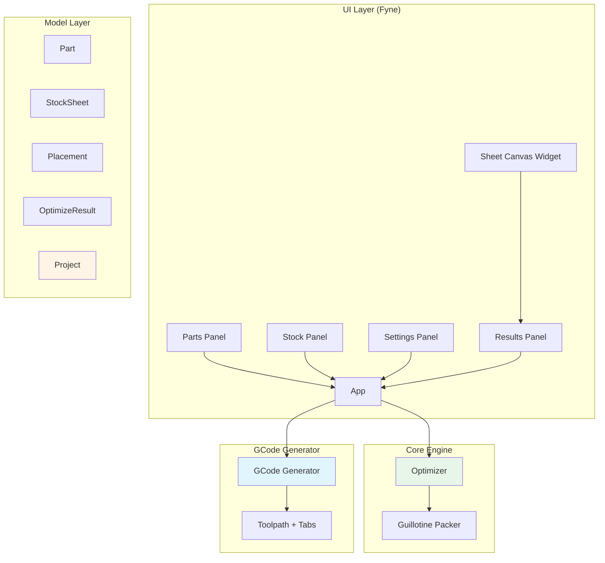

# CutOptimizer - Claude Instructions

Project-specific instructions for CutOptimizer development.

## Project Overview

CutOptimizer is a cross-platform desktop CNC cut list optimizer built with Go and Fyne. It generates optimized 2D rectangular cutting layouts and exports GCode for CNC machines.

**Tech Stack:**
- Go 1.22+
- Fyne v2.5.4 (cross-platform GUI)
- Single binary distribution, no runtime dependencies

## Code Location

```
github.com/pascal/cutoptimizer/
├── cmd/cnc-calculator/  # Entry point (main.go)
├── internal/
│   ├── model/           # Core types (Part, StockSheet, Placement, etc.)
│   ├── engine/          # Guillotine bin packing optimizer
│   ├── gcode/           # GCode generator with toolpath + tabs
│   ├── importer/        # CSV/file import support
│   ├── ui/              # Main Fyne application UI
│   │   └── widgets/     # Custom Fyne widgets (SheetCanvas)
│   └── project/         # Project save/load functionality
├── go.mod
└── Makefile
```

## Git Workflow (MANDATORY)

### Always Use Git Worktrees

**NEVER use `git checkout -b` or `git switch -c` in the main worktree.** The main worktree MUST always stay on `main`. All feature development, bug fixes, and PRs use isolated git worktrees.

### Worktree Directory

All worktrees live in `../cnc-calculator-worktrees/` (sibling to this repo).

### Commands

```bash
# Create a worktree for a new feature/fix (from main worktree)
git fetch origin
git worktree add ../cnc-calculator-worktrees/issue-NUM-description -b issue-NUM-description origin/main

# Work inside the worktree
cd ../cnc-calculator-worktrees/issue-NUM-description

# Push and create PR from the worktree
git push -u origin issue-NUM-description
gh pr create --title "..." --body "..."

# Cleanup after merge (from main worktree)
git worktree remove ../cnc-calculator-worktrees/issue-NUM-description
git branch -d issue-NUM-description
```

### Branch Naming

```
issue-NUM-brief-description
```

Examples: `issue-42-fix-login-auth`, `issue-15-add-export-feature`

### Rules

- **One branch per issue** — each in its own worktree
- **Main worktree stays on `main`** — ALWAYS, no exceptions
- **Worktree directory name matches the branch name**
- **Never have two agents working in the same worktree**
- **Clean up worktrees and delete branches after merging**
- **All PRs are created from worktree branches, never from main**
- **Always `git fetch origin` before creating a worktree** to ensure you branch from latest main

## Architecture



## Development Commands

```bash
# Run
make run  # or: go run ./cmd/cutoptimizer

# Build
make build  # or: go build -o cutoptimizer ./cmd/cutoptimizer

# Test
make test  # or: go test ./...

# Cross-compile
make windows        # Windows .exe
make darwin-arm64   # macOS Apple Silicon
make darwin-amd64   # macOS Intel
make linux          # Linux binary

# Package with fyne-cross (requires: go install github.com/fyne-io/fyne-cross@latest)
make package-windows
make package-darwin
```

## Code Style

### Go Conventions
- Standard Go formatting: `gofmt -w .`
- Package comments at top of files
- Exported functions have documentation
- JSON tags use `snake_case`
- Errors returned, wrapped where useful

### Fyne-Specific Patterns
- Custom widgets extend `widget.BaseWidget`
- Implement `CreateRenderer()` for custom rendering
- Use `container.NewVBox()`, `container.NewGridWithColumns()` for layouts
- Dialogs: `dialog.NewForm()`, `dialog.ShowInformation()`, `dialog.ShowError()`

### Type Design
- Value types for small data (`Part`, `StockSheet`)
- Pointers for optional/large data (`*OptimizeResult`)
- Enums as `int` constants with `String()` method (e.g., `Grain`)

## Testing

```bash
# Run all tests
go test ./...

# With coverage
go test -cover ./...

# Specific package
go test ./internal/engine
```

## Module Information

- **Module**: `github.com/pascal/cutoptimizer`
- **Main package**: `cmd/cutoptimizer`
- **Internal packages**: `model`, `engine`, `gcode`, `ui`, `project`

## Known Issues / TODO

1. **Stock Selection**: `selectBestStock()` is a TODO in optimizer.go
2. **Test Coverage**: No test files exist yet

## Feature Roadmap

From README.md (future improvements):
- Genetic algorithm meta-heuristic
- DXF import for non-rectangular parts
- GCode preview with toolpath visualization
- Multiple stock sheet sizes in one run
- CSV/Excel import
- PDF export
- Undo/redo
- Lead-in/lead-out arcs
- Configurable post-processor profiles
