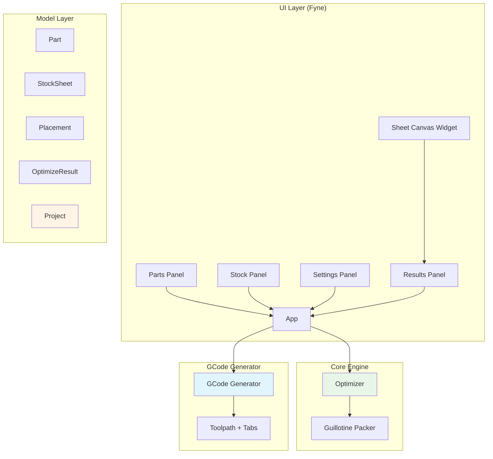

# CutOptimizer - Claude Instructions

Project-specific instructions for CutOptimizer development.

## Project Overview

CutOptimizer is a cross-platform desktop CNC cut list optimizer built with Go and Fyne. It generates optimized 2D rectangular cutting layouts and exports GCode for CNC machines.

**Tech Stack:**
- Go 1.22+
- Fyne v2.5.4 (cross-platform GUI)
- Single binary distribution, no runtime dependencies

## Code Location

**IMPORTANT**: The codebase is currently flat in the repository root but should be organized under the standard Go structure:

```
github.com/pascal/cutoptimizer/
├── cmd/cutoptimizer/    # Entry point (main.go currently at root)
├── internal/
│   ├── model/          # Currently: model.go
│   ├── engine/         # Currently: optimizer.go
│   ├── gcode/          # Currently: generator.go
│   ├── ui/             # Currently: app.go, sheet_canvas.go
│   └── project/        # TODO: save/load functionality
└── go.mod
```

**Current flat structure** (legacy, during refactor):
- `main.go` - Entry point → should be `cmd/cutoptimizer/main.go`
- `model.go` - Core types → should be `internal/model/model.go`
- `optimizer.go` - Bin packing → should be `internal/engine/optimizer.go`
- `generator.go` - GCode output → should be `internal/gcode/generator.go`
- `app.go` - Main UI → should be `internal/ui/app.go`
- `sheet_canvas.go` - Custom widget → should be `internal/ui/widgets/sheet_canvas.go`

## Architecture



## Development Commands

```bash
# Run
make run  # or: go run ./cmd/cutoptimizer

# Build
make build  # or: go build -o cutoptimizer ./cmd/cutoptimizer

# Test
make test  # or: go test ./...

# Cross-compile
make windows        # Windows .exe
make darwin-arm64   # macOS Apple Silicon
make darwin-amd64   # macOS Intel
make linux          # Linux binary

# Package with fyne-cross (requires: go install github.com/fyne-io/fyne-cross@latest)
make package-windows
make package-darwin
```

## Code Style

### Go Conventions
- Standard Go formatting: `gofmt -w .`
- Package comments at top of files
- Exported functions have documentation
- JSON tags use `snake_case`
- Errors returned, wrapped where useful

### Fyne-Specific Patterns
- Custom widgets extend `widget.BaseWidget`
- Implement `CreateRenderer()` for custom rendering
- Use `container.NewVBox()`, `container.NewGridWithColumns()` for layouts
- Dialogs: `dialog.NewForm()`, `dialog.ShowInformation()`, `dialog.ShowError()`

### Type Design
- Value types for small data (`Part`, `StockSheet`)
- Pointers for optional/large data (`*OptimizeResult`)
- Enums as `int` constants with `String()` method (e.g., `Grain`)

## Testing

```bash
# Run all tests
go test ./...

# With coverage
go test -cover ./...

# Specific package
go test ./internal/engine
```

## Module Information

- **Module**: `github.com/pascal/cutoptimizer`
- **Main package**: `cmd/cutoptimizer`
- **Internal packages**: `model`, `engine`, `gcode`, `ui`, `project`

## Known Issues / TODO

1. **File Organization**: Code is flat in root, needs restructuring to `internal/` layout
2. **Stock Selection**: `selectBestStock()` is a TODO (line 119-121 in optimizer.go)
3. **Project Save/Load**: Referenced in app.go but `project` package not yet created
4. **Test Coverage**: No test files exist yet

## Feature Roadmap

From README.md (future improvements):
- Genetic algorithm meta-heuristic
- DXF import for non-rectangular parts
- GCode preview with toolpath visualization
- Multiple stock sheet sizes in one run
- CSV/Excel import
- PDF export
- Undo/redo
- Lead-in/lead-out arcs
- Configurable post-processor profiles
